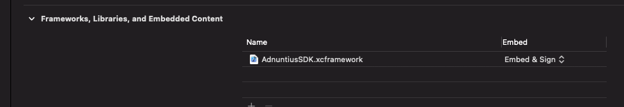
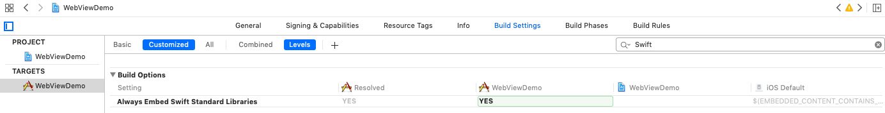

# Adnuntius iOS SDK

Adnuntius iOS SDK is an ios sdk which allows business partners to embed Adnuntius ads in their native ios applications.

## Building

Use Carthage cli to build the AdnuntiusSDK.framework and import into your project.   Create or modify your Cartfile to include:

```
github "Adnuntius/ios_sdk" == 1.5.4
```

Run `carthage update --use-xcframeworks`

### Migrating from Framework bundles

Carthage should be upgraded to at least version 0.38.  Its pretty easy and carthage has the instructions you need.    All the samples have been migrated to use XCFrameworks, which also allows us to get rid of the Xcode 12 workaround

https://github.com/Carthage/Carthage#building-platform-independent-xcframeworks-xcode-12-and-above

An important thing to note, is the Run Script build step is not required and should be deleted when migrating to using XCFrameworks.

### Add to your Project

After carthage update is completed, the AdnuntiusSDK.xcframework must be added to your project as a embedded and signed framework.  
Drag and drop the Carthage/Build/AdnuntiusSDK.xcframework onto your project.



### Objective C Only



Because the SDK is Swift based, if you are including it as a framework into your objective c application, the Swift libraries must also be included, they are not by default.

## Integrating

### loadAd format

Only a single adUnit can be specified in the adUnits array structure, otherwise you can use any of the parameters supported by adn.js within the adUnit request.

https://docs.adnuntius.com/adnuntius-advertising/requesting-ads/intro/adn-request

#### No Cookies support

From SDK version 1.5.0 onwards we support specifying noCookies: true or useCookies: false at the global level (not under the adUnits config)

```swift
let config = [
    "adUnits": [
          ["auId": "000000000006f450", "auW": 200, "kv": [["version": "6s"]]
      ]
    ],
    "useCookies": false
] as [String : Any]
```

#### Live Preview support

This is probably mostly useful for development, but if you want to force a line item / creative combo to appear in your web view, you can specify lpl and lpc parameters
at global level (not under the adUnits config).   

```swift
let config = [
    "adUnits": [
          ["auId": "000000000006f450", "auW": 200, "kv": [["version": "6s"]]
      ]
    ],
    "useCookies": false,
    "lpl": "line item id",
    "lpc": "creative id"
] as [String : Any]
```

### Swift

- Add WkWebView to your storyboard and create outlet
- Configure each AdnuntiusAdWebView
- Load the ad into the view via loadAd (loadFromConfig and loadFromApi are deprecated and will be removed soon)
- Implement the completionHandler


- In your `ViewController` file add header and implement the viewDidLoad method:

```swift
import AdnuntiusSDK
```

Reference the AdnuntiusAdWebView:

```swift
@IBOutlet weak var adView: AdnuntiusAdWebView!
```

And then load the ad of your choice using loadAd:

```swift
    override func viewDidLoad() {
        super.viewDidLoad() 
        
        let config = [
            "adUnits": [
                  ["auId": "000000000006f450", "auW": 200, "kv": [["version": "6s"]]
              ]
            ],
            "useCookies": false
        ] as [String : Any]
        
        let configResult = adView.loadAd(config, completionHandler: self)
        if !configResult {
            print("Config is wrong, check the log")
        }
    }
    
    func onNoAdResponse(_ view: AdnuntiusAdWebView) {
        print("No Ad Found!")
        self.adView.isHidden = true
    }
    
    func onFailure(_ view: AdnuntiusAdWebView, _ message: String) {
	self.adView.isHidden = true
    }
    
    func onAdResponse(_ view: AdnuntiusAdWebView, _ width: Int, _ height: Int) {
        print("onAdResponse: width: \(width), height: \(height)")
	var frame = self.adView.frame
        if (height > 0) {
            frame.size.height = CGFloat(height)
        }
        self.adView.frame = frame
    }
```

The onNoAdResponse, onFailure and onAdResponse AdLoadCompletionHandler methods are where you can add logic to react to various outcomes of trying to load an an ad.  For instance if there are no matched ads, the onNoAdResponse will be called, and you could hide the ad view for instance.

### Objective C

- Add WkWebView to your storyboard and create outlet
- Declare a @property referencing the AdnuntiusAdWebView declared in the story board
- Load the ad into the view via the loadAd
- Implement the completionHandler 

In the ViewController header file import the AdnuntiusSDK swift header:

```swift
    #import <AdnuntiusSDK/AdnuntiusSDK-Swift.h>

    @property (weak, nonatomic) IBOutlet AdnuntiusAdWebView *adView;
```

In the ViewController m file, implement the viewDidLoad method:

```swift
    [super viewDidLoad];

    NSString* adId = @"000000000006f450";

    NSDictionary* config = @{
        @"adUnits" : @[
                @{
                    @"auId":adId, @"auH":@200, @"kv": @[@{@"version" : @"X"}]
                }
        ],
        @"useCookies": @false
    };

    [self.adView loadAd:config completionHandler:self];

- (void)onNoAdResponse:(AdnuntiusAdWebView * _Nonnull)view {
    NSLog(@"No add found");
    self.adView.hidden = true;
}

- (void)onFailure:(AdnuntiusAdWebView * _Nonnull)view :(NSString * _Nonnull)message {
    NSLog(@"Failure: %@", message);
    self.adView.hidden = true;
}

- (void)onAdResponse:(AdnuntiusAdWebView * _Nonnull)view :(NSInteger)width :(NSInteger)height {    
    if (height > 0) {
        CGRect frame = self.adView.frame;
        frame.size.height = height;
        self.adView.frame = frame;
    }
}
```

- Change Info.plist

```xml
    <key>NSAppTransportSecurity</key>
    <dict>
      <key>NSAllowsArbitraryLoads</key>
      <true/>
    </dict>
```

## Upgrading from 1.2.X to 1.4.X or 1.5.X

Between 1.2.X and 1.4.X we had to make some breaking api changes that were unavoidable in order to provide an improved experience and a more consistent use of the SDK

### Removed Api Calls

The loadFromScript and simplified loadFromConfig have been removed from the SDK.

The loadFromApi and loadFromConfig are deprecated in version 1.5.0 and will be removed in a future release.

### Updated Completion Handler

Between 1.3.0 and 1.4.X we made some changes to the completion handlers that are not backwards compatible.

The onFailure handler remains the same
The onComplete get replaces with two new functions:

- onNoAdResponse (which used to be onComplete with adCount == 0)
- onAdResponse

The reason for this, is we have added new arguments to the onAdResponse, including the calculated width and height that are used by the rendered div, so you can use that to
control any resizing of your views.

### Updating from UIWebView to WKWebView

Version 1.4.0 of the SDK is based on WkWebView instead of the deprecated UiWebView.    If you want to use the SDK with interface builder, your target iOS version must be 11, otherwise you will receive the 
dreaded `WKWebView before iOS 11.0 (NSCoding support was broken in previous versions)` error message.   If you are constructing an instance of the AdnuntiusWebView programmatically this should not be an issue.

### Updating your storyboards.    

If you have a fairly simple story board for your ad view, you can replace the `<webview>` with `<wkWebView>` and make sure to add a `<wkWebViewConfiguration>` section as a sub element, like so:

```xml
    <wkWebViewConfiguration key="configuration">
        <audiovisualMediaTypes key="mediaTypesRequiringUserActionForPlayback" none="YES"/>
        <wkPreferences key="preferences"/>
    </wkWebViewConfiguration>
```

## Upgrading from 1.1.4 and 1.1.5

Unfortunately 1.2.0 is not API compatible with 1.1.4 and 1.1.5.  Version 1.2.0 was released with fairly significant upgrades to allow it to work with Objective-C and to enable applications to configure more than one ad configuration in their application.  Before because the configuration was static this was pretty much impossible.

Unfortunately this does mean you will need to make changes to your app to use the new version.  Please refer to the Samples project to figure out what needs to be changed. 

If you want to keep compiling your application with the earlier version of the SDK (1.1.4 or 1.1.5) you should adjust your cartfile as follows:

```
github "Adnuntius/ios_sdk" == 1.1.5
```

# Examples

Some examples of using the SDK are available from https://github.com/Adnuntius/ios_sdk_examples

## Bugs, Issues and Support

This SDK is a work in progress and will be given attention when necessary based on feed back.  You
can raise issues on github or via zen desk at https://admin.adnuntius.com

# License

This project uses the Apache 2 License.  Refer to the LICENSE file.
